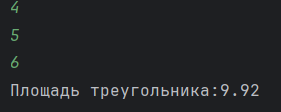
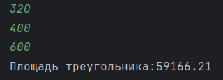
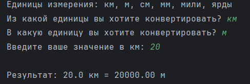
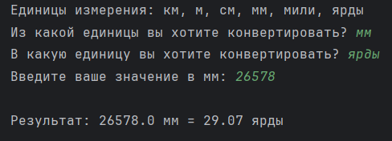
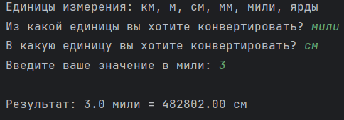
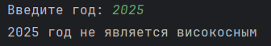
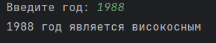
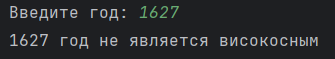

# Исполнитель
Мачулин Даниил \
Группа Фт-240008
# Лабораторная работа №2 - Github

В ходе лабораторной работы требуется создать 3 программы, реализующие: вычисление площади треугольника по формуле Герона; перевод из одной единицы СИ в другую; вычисление, високосний год или нет.
# Среда разработки
Язык программирования: Python. \
Среда разработки: PyCharm

## Задание 1 - Калькулятор площади треугольника
Требуется написать программу, которая вычисляет площадь треугольника по трём его сторонам (по формуле Герона) с точность до сотых. 
## Инструкция по работе
Пользователь вводит с клавиатуры 3 значения, обозначающие длину каждой из сторон треугольника. Компьютер с помощью формулы Герона вычисляет по этим трем сторонам площадь и выводит пользователю значение на экран с двумя знаками после запятой. 

## Результаты тестирования
Тест 1 \
  

Тест 2 \

Тест 3 \
 

## Задание 2 - Конвертер единиц измерения расстояния
Требуется написать программу-конвертер, которая переводит расстояние из одних единиц измерения в другие. Программа должна поддерживать следующие единицы: Километры (км), Метры (м), Сантиметры (см), Миллиметры (мм), Мили (mi), Ярды (yd).
## Инструкция по работе
Пользователь вводит с клавиатуры из какой единицы и в какую единицу он хочет перевести числовое значение и само числовое значение. Компьютер берет данное значение и умножает его на отношение двух значений единиц, которые пользователь выбрал. (За 1 в коде взято значение для метра)

## Результаты тестирования
Тест 1 \
 

Тест 2 \
 

Тест 3 \
 

## Задание 3 - Определение високосного года
Требуется написать программу, которая определяет, является ли введенный год високосным.
## Инструкция по работе
Пользователь вводит с клавиатуры любой год, компьютер прогоняет его через несколько условий: если год високосный, то он должен делиться на 4 либо на 400, однако если год делится на 100, то он не будет являться високосным.

## Результаты тестирования
Тест 1 \

Тест 2 \

Тест 3 \

